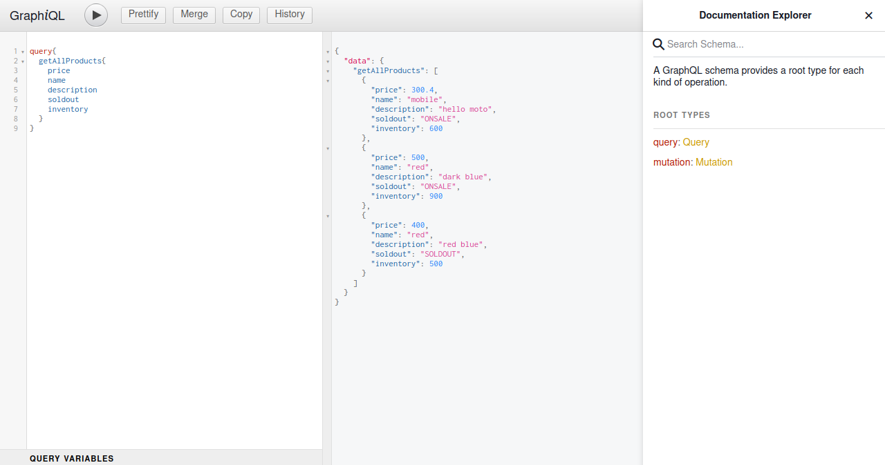
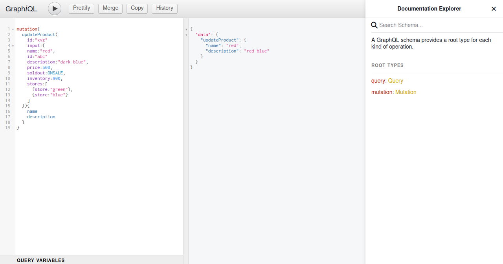
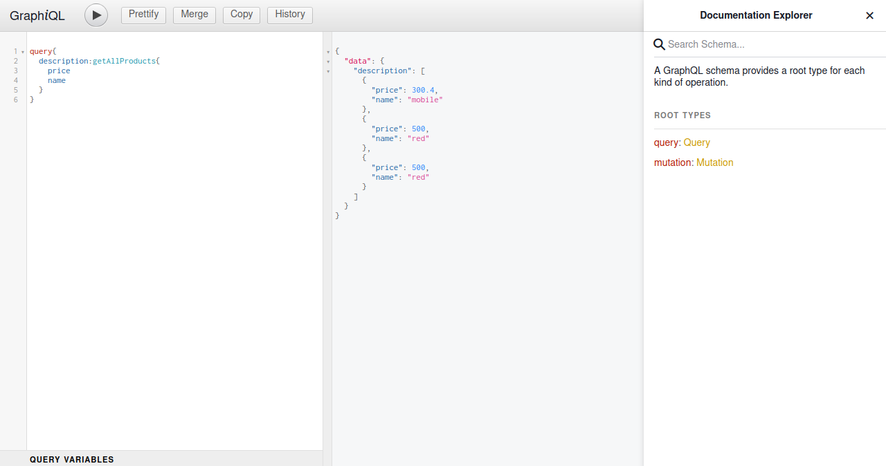
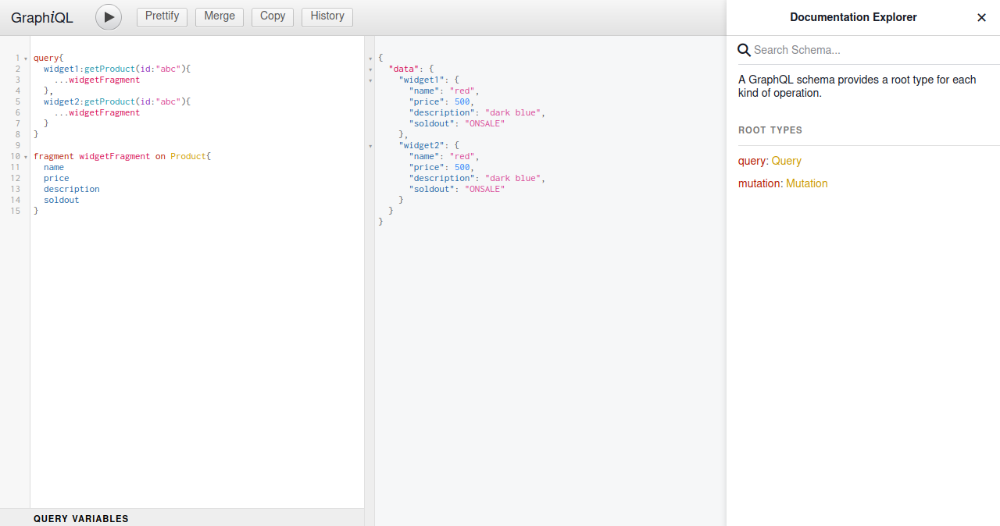

npm install npm express express-graphql graphql nodemon

npm install @babel/cli @babel/node @babel/preset-env

In GraphQL, a query is used to fetch data from the server, while a mutation is used to modify data on the server.

A query in GraphQL is similar to a GET request in RESTful APIs. It's used to retrieve data from the server, but with GraphQL, you can specify exactly what data you want to retrieve, and in what shape. Queries have a read-only nature and should not modify the data on the server.

A mutation in GraphQL is used to modify data on the server, such as creating, updating, or deleting data. Mutations can change the data on the server-side and should be used with caution. Mutations are similar to POST, PUT, PATCH, and DELETE requests in RESTful APIs.

The input type in GraphQL is used to pass a complex set of input parameters to a mutation operation. It allows you to group together multiple input arguments into a single parameter. Using an input type simplifies the mutation operation's input signature, making it easier to read and write.

Here's an example of a GraphQL mutation with an input type:

css

mutation CreatePost($input: PostInput!) {
createPost(input: $input) {
id
title
body
}
}

In this example, the CreatePost mutation operation takes an input parameter of type PostInput, which groups together multiple input arguments, such as title and body. The $input variable is passed into the mutation operation as an argument.

To summarize, queries are used to fetch data, mutations are used to modify data, and the input type is used to group multiple input arguments into a single parameter for mutations.

GraphQL provides a single endpoint that allows clients to specify the exact data they need, and the server returns only that data in response. With GraphQL, the client defines the structure of the data they want to receive, and the server responds with exactly that data in a JSON format.

Screenshots

